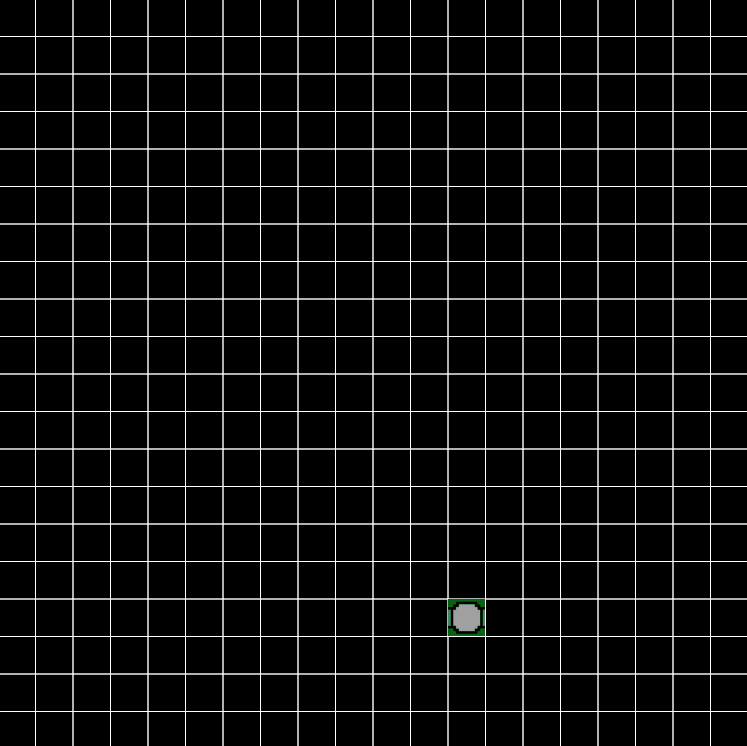

# Wave Function Collapse

Wave Function Collapse is an algorithm for procedural generation of images.

Inspired by Dan Shiffman from Coding Train, I recreated the this algorithm using JavaScript with p5.js, with a few optimization of my own.

[Wave Function Collapse Youtube video](https://www.youtube.com/watch?v=rI_y2GAlQFM)

# [Live demo](https://hans-min.github.io/wave-function-collapse/)
