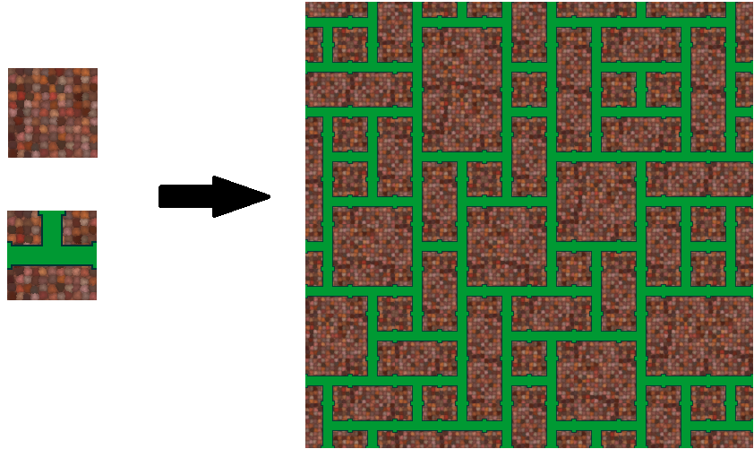
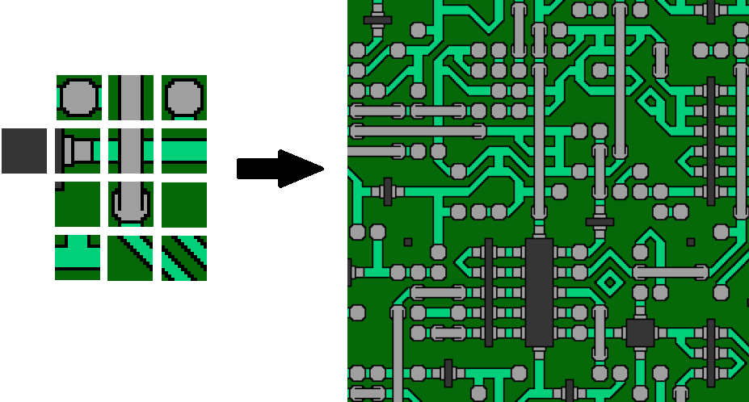

# Wave Function Collapse

[Wave Function Collapse (WFC)](https://github.com/mxgmn/WaveFunctionCollapse) by @exutumno is a new algorithm that can generate procedural patterns from a sample image. It's especially exciting for game designers/developers, letting us draw out our ideas instead of hand-coding them.

Inspired by [this Youtube video](https://www.youtube.com/watch?v=rI_y2GAlQFM) by Dan Shiffman from [Coding Train](https://thecodingtrain.com/challenges/171-wave-function-collapse), I recreated the algorithm using JavaScript with p5.js, with a few optimization of my own.

## [Click here for a live demo](https://hans-min.github.io/wave-function-collapse/)

---

- [ ] Attempting to create 3D procedural map using WFC
